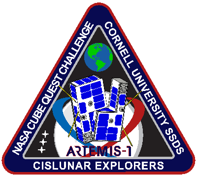

# Warning
This repository is no longer used or maintained. However, many lessons have been learned that are worth sharing and distributing. If you are interested in picking up some lessons and wild stories, reach out to apz24@cornell.edu 

# Cislunar Explorers Flight Software

## About

### Mission

The Cislunar Explorers are a pair of CubeSats in a 6U configuration that will be
a secondary payload onboard a future launch. The mission objectives are to:

- Demonstrate a water electrolysis-based propulsion system
- Demonstrate an optical attitude and position determination system running on
  inexpensive COTS hardware
- Achieve Lunar orbit

### Flight Software

The software in this repository will run the satellite's flight computers, with
the main loop is defined in the `run` method of `main.py`. Here, each step of
the loop is defined by which flight mode the satellite is currently in.

### Documentation

See [CQP-STF-001](https://cornell.app.box.com/file/795910589458).

### Contact Info

- Software Leads: [Stephen Zakoworotny](mailto:sjz38@cornell.edu) &
  [Tobias Fischer](mailto:tmf97@cornell.edu)
- Mission Manager: [Charlie Robinson](mailto:cr462@cornell.edu)

## Gettings Started

Read through [CONTRIBUTING](CONTRIBUTING.md).
